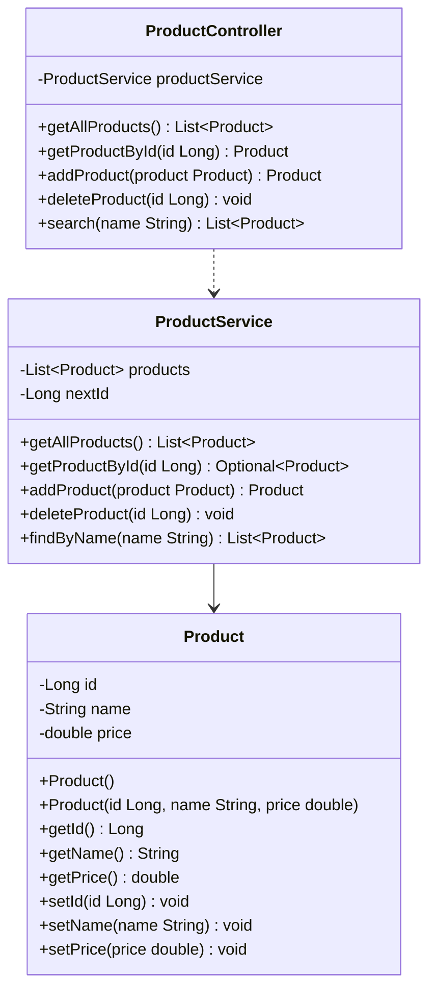

```mermaid
classDiagram
    class Product {
        -Long id
        -String name
        -double price
        +Product()
        +Product(id Long, name String, price double)
        +getId() Long
        +getName() String
        +getPrice() double
        +setId(id Long) void
        +setName(name String) void
        +setPrice(price double) void
    }
    class ProductService {
        -List~Product~ products
        -Long nextId
        +getAllProducts() List~Product~
        +getProductById(id Long) Optional~Product~
        +addProduct(product Product) Product
        +deleteProduct(id Long) void
        +findByName(name String) List~Product~
    }
    class ProductController {
        -ProductService productService
        +getAllProducts() List~Product~
        +getProductById(id Long) Product
        +addProduct(product Product) Product
        +deleteProduct(id Long) void
        +search(name String) List~Product~
    }
    ProductController ..> ProductService
    ProductService --> Product
```