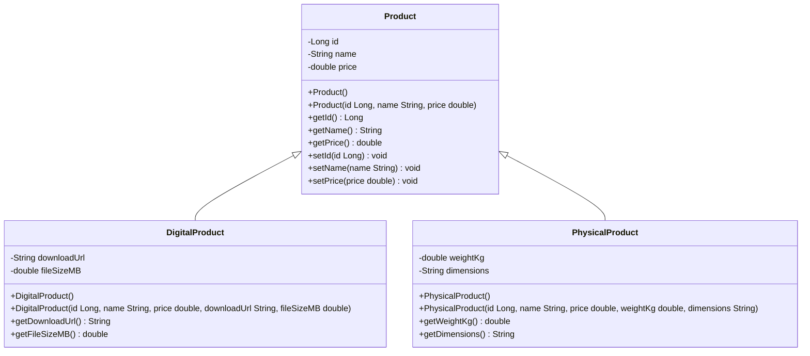

```mermaid
classDiagram
    class Product {
        -Long id
        -String name
        -double price
        +Product()
        +Product(id Long, name String, price double)
        +getId() Long
        +getName() String
        +getPrice() double
        +setId(id Long) void
        +setName(name String) void
        +setPrice(price double) void
    }
    class DigitalProduct {
        -String downloadUrl
        -double fileSizeMB
        +DigitalProduct()
        +DigitalProduct(id Long, name String, price double, downloadUrl String, fileSizeMB double)
        +getDownloadUrl() String
        +getFileSizeMB() double
    }
    class PhysicalProduct {
        -double weightKg
        -String dimensions
        +PhysicalProduct()
        +PhysicalProduct(id Long, name String, price double, weightKg double, dimensions String)
        +getWeightKg() double
        +getDimensions() String
    }
    Product <|-- DigitalProduct
    Product <|-- PhysicalProduct
```