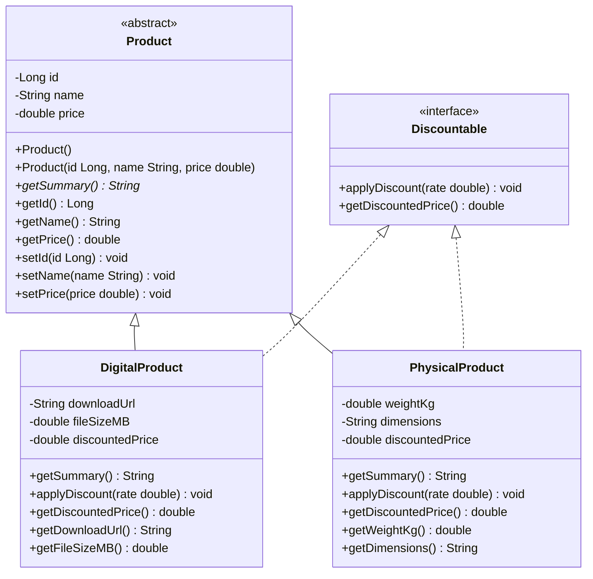

```mermaid
classDiagram
    class Product {
        <<abstract>>
        -Long id
        -String name
        -double price
        +Product()
        +Product(id Long, name String, price double)
        +getSummary()* String
        +getId() Long
        +getName() String
        +getPrice() double
        +setId(id Long) void
        +setName(name String) void
        +setPrice(price double) void
    }
    class Discountable {
        <<interface>>
        +applyDiscount(rate double) void
        +getDiscountedPrice() double
    }
    class DigitalProduct {
        -String downloadUrl
        -double fileSizeMB
        -double discountedPrice
        +getSummary() String
        +applyDiscount(rate double) void
        +getDiscountedPrice() double
        +getDownloadUrl() String
        +getFileSizeMB() double
    }
    class PhysicalProduct {
        -double weightKg
        -String dimensions
        -double discountedPrice
        +getSummary() String
        +applyDiscount(rate double) void
        +getDiscountedPrice() double
        +getWeightKg() double
        +getDimensions() String
    }
    Product <|-- DigitalProduct
    Product <|-- PhysicalProduct
    Discountable <|.. DigitalProduct
    Discountable <|.. PhysicalProduct
```